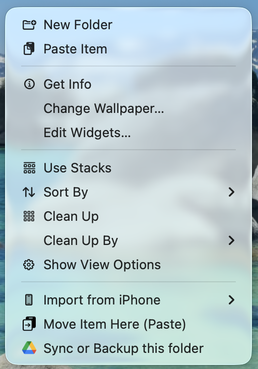

# Move Here for Finder

A tiny macOS Finder extension that adds a **"Move Item Here (Paste)"** option to your right-click menu.

Ever copy a file and wish you could *move* it instead of pasting a duplicate? macOS can do this with `Cmd+Option+V`, but nobody remembers that shortcut. This extension puts the option right in your context menu where it belongs.

 



## How it works

1. **Copy** a file or folder in Finder (`Cmd+C`)
2. **Navigate** to the destination folder
3. **Right-click** in the empty space
4. Click **"Move Item Here (Paste)"**

The file moves. The clipboard clears. Done.

If the destination already has a file with the same name, you'll get a prompt to replace or skip.

## Install

### From source (requires Xcode)

```bash
git clone https://github.com/ojhurst/finder-move.git
cd finder-move
brew install xcodegen  # if you don't have it
xcodegen generate
xcodebuild -project MoveHelper.xcodeproj -scheme MoveHelper -configuration Release build
```

Copy the built app from `DerivedData` to `/Applications`:

```bash
cp -R ~/Library/Developer/Xcode/DerivedData/MoveHelper-*/Build/Products/Release/MoveHelper.app /Applications/
```

Launch it, then enable the extension:

```bash
open /Applications/MoveHelper.app
pluginkit -e use -i com.ojhurst.MoveHelper.MoveHereExtension
```

### Verify it's running

```bash
pluginkit -m -p com.apple.FinderSync
```

You should see `+  com.ojhurst.MoveHelper.MoveHereExtension` in the output.

## Uninstall

```bash
pluginkit -e ignore -i com.ojhurst.MoveHelper.MoveHereExtension
rm -rf /Applications/MoveHelper.app
```

## How it's built

- **MoveHelper** — A minimal container app with no UI. Hides from the Dock. Exists only to host the extension.
- **MoveHereExtension** — A [Finder Sync Extension](https://developer.apple.com/documentation/findersync) that watches all mounted volumes and adds the context menu item when files are on the clipboard.

Built with Swift, uses XcodeGen for project generation.

## Contributing

Contributions are welcome! See [CONTRIBUTING.md](CONTRIBUTING.md) for guidelines.

## License

[MIT](LICENSE) — do whatever you want with it.
